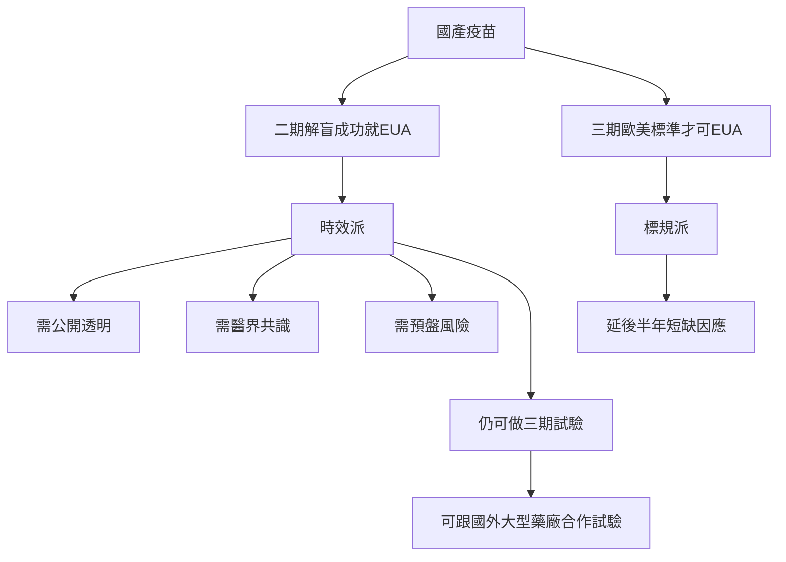

<!-- Generator: Widdershins v4.0.1 -->

<h1 id="nft-market">NFT Market v0.0.1</h1>

> Scroll down for code samples, example requests and responses. Select a language for code samples from the tabs above or the mobile navigation menu.

NFT Market API

Base URLs:

* <a href="http://localhost/api/master/v0">http://localhost/api/master/v0</a>

# Authentication

* API Key (BaseApiKey)
    - Parameter Name: **apikey**, in: header. 

<h1 id="nft-market-base">base</h1>

base api define

## get__base_ping

> Code samples

```javascript

const headers = {
  'Accept':'application/json'
};

fetch('http://localhost/api/master/v0/base/ping',
{
  method: 'GET',

  headers: headers
})
.then(function(res) {
    return res.json();
}).then(function(body) {
    console.log(body);
});

```

`GET /base/ping`

*伺服器作動檢查*

檢查伺服器是否有回應，并取得伺服器時間戳。

<h3 id="get__base_ping-parameters">Parameters</h3>

|Name|In|Type|Required|Description|
|---|---|---|---|---|
|now|query|integer|false|本地時間戳|

> Example responses

> 200 Response

```json
0
```

<h3 id="get__base_ping-responses">Responses</h3>

|Status|Meaning|Description|Schema|
|---|---|---|---|
|200|[OK](https://tools.ietf.org/html/rfc7231#section-6.3.1)|OK|integer|
|default|Default|Error response|[BaseError](#schemabaseerror)|

<aside class="success">
This operation does not require authentication
</aside>

<h1 id="nft-market-blank">blank</h1>

base api define

## get__blank_ping

> Code samples

```javascript

const headers = {
  'Accept':'application/json'
};

fetch('http://localhost/api/master/v0/blank/ping',
{
  method: 'GET',

  headers: headers
})
.then(function(res) {
    return res.json();
}).then(function(body) {
    console.log(body);
});

```

`GET /blank/ping`

*伺服器作動檢查*

檢查伺服器是否有回應，并取得伺服器時間戳。

[](https://mermaid-js.github.io/mermaid-live-editor/edit#pako:eNp1kctOwkAUhl-FzFpeoCYmJvAE6q6bhg5CQgup7cIQEjRBgQLtQsqtsQSRi0gQQ7yA8jScmfYtnAYwMcLu5Pzff65pFEmKGHHoXBFSscBp6JCXwdbpXYdaI1evBYNHq3mJ2I7bf6CtV5I3oejAyzR8dryD_CgwkoxNuqyQQYPMLVIogzFZw_vqMCNpXJNqnsyWPra_iE8OGm7PWJO_Lpb37Czknj1L97IGqVf-q97NiFZLkJu64_oOtW3SVtfrDLzm01-VbbXw28NVcz2ZO-x5w5oPbUdhDCzeYFmCchE-Z9QZ0685tNrktuDvs8vuW4yJ--6wC0LXgm4f7nW39giLNpj51be96YIOkIQVSYiL7EVpXg4EeKTGsIR5xLFQxFFBS6g84uUMQ7WUKKg4LMbVpIK4qJC4wAdI0NTkyaUcQZyqaHgLheIC-7i0oTI_eBgjqw)



<h3 id="get__blank_ping-parameters">Parameters</h3>

|Name|In|Type|Required|Description|
|---|---|---|---|---|
|now|query|integer|false|本地時間戳|

> Example responses

> 200 Response

```json
1653532830797
```

<h3 id="get__blank_ping-responses">Responses</h3>

|Status|Meaning|Description|Schema|
|---|---|---|---|
|200|[OK](https://tools.ietf.org/html/rfc7231#section-6.3.1)|OK|integer|
|default|Default|Error response|[BaseError](#schemabaseerror)|

<aside class="success">
This operation does not require authentication
</aside>

<h1 id="nft-market-guest">guest</h1>

未登入使用者操作界面

## guestRegisterPhone

<a id="opIdguestRegisterPhone"></a>

> Code samples

```javascript
const inputBody = '{
  "email": "string",
  "emailVerify": "string",
  "phone": "string",
  "phoneVerify": "string",
  "password": "string"
}';
const headers = {
  'Content-Type':'application/json',
  'Accept':'application/json'
};

fetch('http://localhost/api/master/v0/guest/register/phone',
{
  method: 'POST',
  body: inputBody,
  headers: headers
})
.then(function(res) {
    return res.json();
}).then(function(body) {
    console.log(body);
});

```

`POST /guest/register/phone`

Register a new user by phone.

> Body parameter

```json
{
  "email": "string",
  "emailVerify": "string",
  "phone": "string",
  "phoneVerify": "string",
  "password": "string"
}
```

<h3 id="guestregisterphone-parameters">Parameters</h3>

|Name|In|Type|Required|Description|
|---|---|---|---|---|
|body|body|object|true|Register informations|
|» email|body|string|true|none|
|» emailVerify|body|string|true|none|
|» phone|body|string|true|none|
|» phoneVerify|body|string|true|none|
|» password|body|string|true|none|

> Example responses

> 200 Response

```json
{
  "userId": "string",
  "token": "string"
}
```

<h3 id="guestregisterphone-responses">Responses</h3>

|Status|Meaning|Description|Schema|
|---|---|---|---|
|200|[OK](https://tools.ietf.org/html/rfc7231#section-6.3.1)|Auth token.|Inline|
|403|[Forbidden](https://tools.ietf.org/html/rfc7231#section-6.5.3)|注冊資訊錯誤|Inline|
|default|Default|Error response|[BaseError](#schemabaseerror)|

<h3 id="guestregisterphone-responseschema">Response Schema</h3>

Status Code **200**

*Login token*

|Name|Type|Required|Restrictions|Description|
|---|---|---|---|---|
|» userId|string|true|none|none|
|» token|string|true|none|none|

Status Code **403**

*回傳對應欄位的錯誤訊息/代號*

|Name|Type|Required|Restrictions|Description|
|---|---|---|---|---|
|» email|string|false|none|none|
|» emailVerify|string|false|none|none|
|» phone|string|false|none|none|
|» phoneVerify|string|false|none|none|
|» password|string|false|none|none|

<aside class="success">
This operation does not require authentication
</aside>

## guestLoginPassword

<a id="opIdguestLoginPassword"></a>

> Code samples

```javascript
const inputBody = '{
  "account": "string",
  "password": "string"
}';
const headers = {
  'Content-Type':'application/json',
  'Accept':'application/json'
};

fetch('http://localhost/api/master/v0/guest/login/password',
{
  method: 'POST',
  body: inputBody,
  headers: headers
})
.then(function(res) {
    return res.json();
}).then(function(body) {
    console.log(body);
});

```

`POST /guest/login/password`

Login by email and password.

> Body parameter

```json
{
  "account": "string",
  "password": "string"
}
```

<h3 id="guestloginpassword-parameters">Parameters</h3>

|Name|In|Type|Required|Description|
|---|---|---|---|---|
|body|body|object|true|Login fields|
|» account|body|string|true|email|
|» password|body|string|true|none|

> Example responses

> 200 Response

```json
{
  "userId": "string",
  "token": "string"
}
```

<h3 id="guestloginpassword-responses">Responses</h3>

|Status|Meaning|Description|Schema|
|---|---|---|---|
|200|[OK](https://tools.ietf.org/html/rfc7231#section-6.3.1)|Auth token.|Inline|
|401|[Unauthorized](https://tools.ietf.org/html/rfc7235#section-3.1)|登入資訊錯誤|Inline|
|default|Default|Error response|[BaseError](#schemabaseerror)|

<h3 id="guestloginpassword-responseschema">Response Schema</h3>

Status Code **200**

*Login token*

|Name|Type|Required|Restrictions|Description|
|---|---|---|---|---|
|» userId|string|true|none|none|
|» token|string|true|none|none|

Status Code **401**

*回傳對應欄位的錯誤訊息/代號*

|Name|Type|Required|Restrictions|Description|
|---|---|---|---|---|
|» account|string|false|none|none|
|» password|string|false|none|none|

<aside class="success">
This operation does not require authentication
</aside>

## guestVerifyEmail

<a id="opIdguestVerifyEmail"></a>

> Code samples

```javascript
const inputBody = '{
  "email": "string",
  "lang": "en-US"
}';
const headers = {
  'Content-Type':'application/json',
  'Accept':'application/json'
};

fetch('http://localhost/api/master/v0/guest/verify/email',
{
  method: 'POST',
  body: inputBody,
  headers: headers
})
.then(function(res) {
    return res.json();
}).then(function(body) {
    console.log(body);
});

```

`POST /guest/verify/email`

寄發電子郵件檢查碼信件

> Body parameter

```json
{
  "email": "string",
  "lang": "en-US"
}
```

<h3 id="guestverifyemail-parameters">Parameters</h3>

|Name|In|Type|Required|Description|
|---|---|---|---|---|
|body|body|object|true|none|
|» email|body|string|true|none|
|» lang|body|string|false|none|

> Example responses

> 200 Response

```json
1653502991840
```

<h3 id="guestverifyemail-responses">Responses</h3>

|Status|Meaning|Description|Schema|
|---|---|---|---|
|200|[OK](https://tools.ietf.org/html/rfc7231#section-6.3.1)|OK|integer|
|403|[Forbidden](https://tools.ietf.org/html/rfc7231#section-6.5.3)|資訊錯誤|Inline|
|default|Default|Error response|[BaseError](#schemabaseerror)|

<h3 id="guestverifyemail-responseschema">Response Schema</h3>

Status Code **403**

*回傳對應欄位的錯誤訊息/代號*

|Name|Type|Required|Restrictions|Description|
|---|---|---|---|---|
|» email|string|false|none|none|
|» time|integer|false|none|下次可執行時間|

<aside class="success">
This operation does not require authentication
</aside>

## guestVerifyPhone

<a id="opIdguestVerifyPhone"></a>

> Code samples

```javascript
const inputBody = '{
  "phone": 886987654321,
  "lang": "en-US"
}';
const headers = {
  'Content-Type':'application/json',
  'Accept':'application/json'
};

fetch('http://localhost/api/master/v0/guest/verify/phone',
{
  method: 'POST',
  body: inputBody,
  headers: headers
})
.then(function(res) {
    return res.json();
}).then(function(body) {
    console.log(body);
});

```

`POST /guest/verify/phone`

寄發手機檢查碼簡訊

> Body parameter

```json
{
  "phone": 886987654321,
  "lang": "en-US"
}
```

<h3 id="guestverifyphone-parameters">Parameters</h3>

|Name|In|Type|Required|Description|
|---|---|---|---|---|
|body|body|object|true|none|
|» phone|body|string|true|none|
|» lang|body|string|false|none|

> Example responses

> 200 Response

```json
1653502991840
```

<h3 id="guestverifyphone-responses">Responses</h3>

|Status|Meaning|Description|Schema|
|---|---|---|---|
|200|[OK](https://tools.ietf.org/html/rfc7231#section-6.3.1)|OK|integer|
|403|[Forbidden](https://tools.ietf.org/html/rfc7231#section-6.5.3)|資訊錯誤|Inline|
|default|Default|Error response|[BaseError](#schemabaseerror)|

<h3 id="guestverifyphone-responseschema">Response Schema</h3>

Status Code **403**

*回傳對應欄位的錯誤訊息/代號*

|Name|Type|Required|Restrictions|Description|
|---|---|---|---|---|
|» phone|string|false|none|none|
|» time|integer|false|none|下次可執行時間|

<aside class="success">
This operation does not require authentication
</aside>

## guestResetPassword

<a id="opIdguestResetPassword"></a>

> Code samples

```javascript
const inputBody = '{
  "email": "string",
  "emailVerify": "string",
  "phoneVerify": "string",
  "password": "string"
}';
const headers = {
  'Content-Type':'application/json',
  'Accept':'application/json'
};

fetch('http://localhost/api/master/v0/guest/reset/password',
{
  method: 'POST',
  body: inputBody,
  headers: headers
})
.then(function(res) {
    return res.json();
}).then(function(body) {
    console.log(body);
});

```

`POST /guest/reset/password`

Reset member password.

> Body parameter

```json
{
  "email": "string",
  "emailVerify": "string",
  "phoneVerify": "string",
  "password": "string"
}
```

<h3 id="guestresetpassword-parameters">Parameters</h3>

|Name|In|Type|Required|Description|
|---|---|---|---|---|
|body|body|object|true|Reset informations|
|» email|body|string|true|none|
|» emailVerify|body|string|true|none|
|» phoneVerify|body|string|true|none|
|» password|body|string|true|none|

> Example responses

> 200 Response

```json
{
  "userId": "string",
  "token": "string"
}
```

<h3 id="guestresetpassword-responses">Responses</h3>

|Status|Meaning|Description|Schema|
|---|---|---|---|
|200|[OK](https://tools.ietf.org/html/rfc7231#section-6.3.1)|Auth token.|Inline|
|403|[Forbidden](https://tools.ietf.org/html/rfc7231#section-6.5.3)|注冊資訊錯誤|Inline|
|default|Default|Error response|[BaseError](#schemabaseerror)|

<h3 id="guestresetpassword-responseschema">Response Schema</h3>

Status Code **200**

*Login token*

|Name|Type|Required|Restrictions|Description|
|---|---|---|---|---|
|» userId|string|true|none|none|
|» token|string|true|none|none|

Status Code **403**

*回傳對應欄位的錯誤訊息/代號*

|Name|Type|Required|Restrictions|Description|
|---|---|---|---|---|
|» email|string|false|none|none|
|» emailVerify|string|false|none|none|
|» phoneVerify|string|false|none|none|
|» password|string|false|none|none|

<aside class="success">
This operation does not require authentication
</aside>

## guestVerifyAccountPhone

<a id="opIdguestVerifyAccountPhone"></a>

> Code samples

```javascript
const inputBody = '{
  "email": "string",
  "lang": "en-US"
}';
const headers = {
  'Content-Type':'application/json',
  'Accept':'application/json'
};

fetch('http://localhost/api/master/v0/guest/verify/account/phone',
{
  method: 'POST',
  body: inputBody,
  headers: headers
})
.then(function(res) {
    return res.json();
}).then(function(body) {
    console.log(body);
});

```

`POST /guest/verify/account/phone`

依帳號關聯手機號碼寄發檢查碼簡訊

> Body parameter

```json
{
  "email": "string",
  "lang": "en-US"
}
```

<h3 id="guestverifyaccountphone-parameters">Parameters</h3>

|Name|In|Type|Required|Description|
|---|---|---|---|---|
|body|body|object|true|none|
|» email|body|string|true|none|
|» lang|body|string|false|none|

> Example responses

> 200 Response

```json
1653502991840
```

<h3 id="guestverifyaccountphone-responses">Responses</h3>

|Status|Meaning|Description|Schema|
|---|---|---|---|
|200|[OK](https://tools.ietf.org/html/rfc7231#section-6.3.1)|OK|integer|
|403|[Forbidden](https://tools.ietf.org/html/rfc7231#section-6.5.3)|資訊錯誤|Inline|
|default|Default|Error response|[BaseError](#schemabaseerror)|

<h3 id="guestverifyaccountphone-responseschema">Response Schema</h3>

Status Code **403**

*回傳對應欄位的錯誤訊息/代號*

|Name|Type|Required|Restrictions|Description|
|---|---|---|---|---|
|» email|string|false|none|none|
|» time|integer|false|none|下次可執行時間|

<aside class="success">
This operation does not require authentication
</aside>

<h1 id="nft-market-member">member</h1>

已登入使用者操作界面

## memberInfo

<a id="opIdmemberInfo"></a>

> Code samples

```javascript

const headers = {
  'Accept':'application/json',
  'apikey':'API_KEY'
};

fetch('http://localhost/api/master/v0/member/info',
{
  method: 'GET',

  headers: headers
})
.then(function(res) {
    return res.json();
}).then(function(body) {
    console.log(body);
});

```

`GET /member/info`

check and renew auth token

> Example responses

> 200 Response

```json
{
  "userId": "string",
  "email": "string",
  "level": 0
}
```

<h3 id="memberinfo-responses">Responses</h3>

|Status|Meaning|Description|Schema|
|---|---|---|---|
|200|[OK](https://tools.ietf.org/html/rfc7231#section-6.3.1)|會員基本資料|Inline|
|401|[Unauthorized](https://tools.ietf.org/html/rfc7235#section-3.1)|登入資訊錯誤|None|
|default|Default|Error response|[BaseError](#schemabaseerror)|

<h3 id="memberinfo-responseschema">Response Schema</h3>

Status Code **200**

|Name|Type|Required|Restrictions|Description|
|---|---|---|---|---|
|» userId|string|false|none|none|
|» email|string|false|none|none|
|» level|integer|false|none|none|

<aside class="warning">
To perform this operation, you must be authenticated by means of one of the following methods:
BaseApiKey
</aside>

<h1 id="nft-market-wallet">wallet</h1>

錢包操作及幣價資訊

## walletBalance

<a id="opIdwalletBalance"></a>

> Code samples

```javascript
const inputBody = '{
  "userId": "string"
}';
const headers = {
  'Content-Type':'application/json',
  'Accept':'application/json',
  'apikey':'API_KEY'
};

fetch('http://localhost/api/master/v0/wallet/balance',
{
  method: 'POST',
  body: inputBody,
  headers: headers
})
.then(function(res) {
    return res.json();
}).then(function(body) {
    console.log(body);
});

```

`POST /wallet/balance`

wallet balance

> Body parameter

```json
{
  "userId": "string"
}
```

<h3 id="walletbalance-parameters">Parameters</h3>

|Name|In|Type|Required|Description|
|---|---|---|---|---|
|body|body|object|true|user id|
|» userId|body|string|true|none|

> Example responses

> 200 Response

```json
[
  {
    "symbol": "ETH",
    "unit": "ether",
    "decimal": 4,
    "balance": 0,
    "lock": 0
  }
]
```

<h3 id="walletbalance-responses">Responses</h3>

|Status|Meaning|Description|Schema|
|---|---|---|---|
|200|[OK](https://tools.ietf.org/html/rfc7231#section-6.3.1)|錢包餘額|Inline|
|401|[Unauthorized](https://tools.ietf.org/html/rfc7235#section-3.1)|登入資訊錯誤|None|
|default|Default|Error response|[BaseError](#schemabaseerror)|

<h3 id="walletbalance-responseschema">Response Schema</h3>

Status Code **200**

|Name|Type|Required|Restrictions|Description|
|---|---|---|---|---|
|» symbol|string|false|none|虛擬貨幣名稱|
|» unit|string|false|none|錢包使用單位|
|» decimal|integer|false|none|小數位數|
|» balance|number|false|none|可動用餘額|
|» lock|number|false|none|鎖倉金額|

<aside class="warning">
To perform this operation, you must be authenticated by means of one of the following methods:
BaseApiKey
</aside>

## walletHistory

<a id="opIdwalletHistory"></a>

> Code samples

```javascript
const inputBody = '{
  "userId": "string",
  "offset": 0
}';
const headers = {
  'Content-Type':'application/json',
  'Accept':'application/json',
  'apikey':'API_KEY'
};

fetch('http://localhost/api/master/v0/wallet/history',
{
  method: 'POST',
  body: inputBody,
  headers: headers
})
.then(function(res) {
    return res.json();
}).then(function(body) {
    console.log(body);
});

```

`POST /wallet/history`

wallet history

> Body parameter

```json
{
  "userId": "string",
  "offset": 0
}
```

<h3 id="wallethistory-parameters">Parameters</h3>

|Name|In|Type|Required|Description|
|---|---|---|---|---|
|body|body|object|true|user id|
|» userId|body|string|true|none|
|» offset|body|integer|false|none|

> Example responses

> 200 Response

```json
{
  "total": 0,
  "offset": 0,
  "list": [
    {
      "id": "string",
      "time": 0,
      "name": "string",
      "symbol": "string",
      "direction": "diposit",
      "amount": 0,
      "status": "success"
    }
  ]
}
```

<h3 id="wallethistory-responses">Responses</h3>

|Status|Meaning|Description|Schema|
|---|---|---|---|
|200|[OK](https://tools.ietf.org/html/rfc7231#section-6.3.1)|錢包存提紀錄|Inline|
|401|[Unauthorized](https://tools.ietf.org/html/rfc7235#section-3.1)|登入資訊錯誤|None|
|default|Default|Error response|[BaseError](#schemabaseerror)|

<h3 id="wallethistory-responseschema">Response Schema</h3>

Status Code **200**

|Name|Type|Required|Restrictions|Description|
|---|---|---|---|---|
|» total|integer|false|none|none|
|» offset|integer|false|none|none|
|» list|[object]|false|none|none|
|»» id|string|false|none|none|
|»» time|number|false|none|none|
|»» name|string|false|none|none|
|»» symbol|string|false|none|none|
|»» direction|string|false|none|none|
|»» amount|number|false|none|none|
|»» status|string|false|none|none|

#### Enumerated Values

|Property|Value|
|---|---|
|direction|diposit|
|direction|withdraw|
|status|success|
|status|cancel|
|status|processing|
|status|waiting|

<aside class="warning">
To perform this operation, you must be authenticated by means of one of the following methods:
BaseApiKey
</aside>

# Schemas

<h2 id="tocS_BaseAny">BaseAny</h2>
<!-- backwards compatibility -->
<a id="schemabaseany"></a>
<a id="schema_BaseAny"></a>
<a id="tocSbaseany"></a>
<a id="tocsbaseany"></a>

```json
{}

```

### Properties

*None*

<h2 id="tocS_BaseArrayAny">BaseArrayAny</h2>
<!-- backwards compatibility -->
<a id="schemabasearrayany"></a>
<a id="schema_BaseArrayAny"></a>
<a id="tocSbasearrayany"></a>
<a id="tocsbasearrayany"></a>

```json
[
  {}
]

```

### Properties

|Name|Type|Required|Restrictions|Description|
|---|---|---|---|---|
|*anonymous*|[[BaseAny](#schemabaseany)]|false|none|none|

<h2 id="tocS_BaseError">BaseError</h2>
<!-- backwards compatibility -->
<a id="schemabaseerror"></a>
<a id="schema_BaseError"></a>
<a id="tocSbaseerror"></a>
<a id="tocsbaseerror"></a>

```json
{
  "code": 0,
  "message": "string",
  "data": {}
}

```

### Properties

|Name|Type|Required|Restrictions|Description|
|---|---|---|---|---|
|code|integer|true|none|Error code|
|message|string|false|none|Error Message|
|data|[BaseAny](#schemabaseany)|false|none|none|

