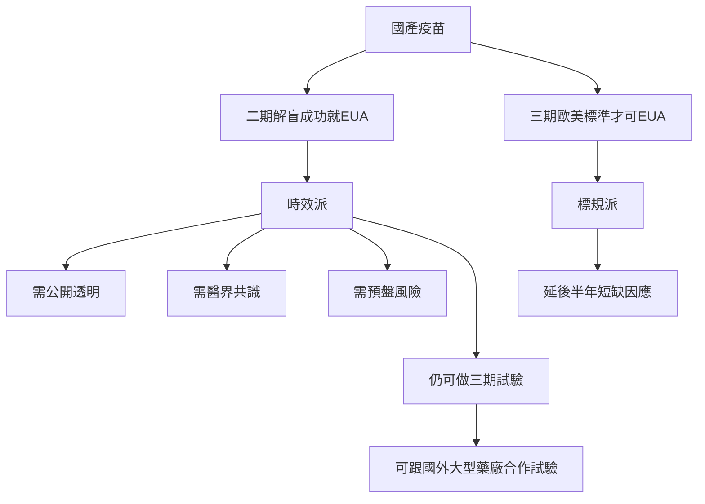

<!-- Generator: Widdershins v4.0.1 -->

<h1 id="nft-market">NFT Market v0.0.1</h1>

> Scroll down for code samples, example requests and responses. Select a language for code samples from the tabs above or the mobile navigation menu.

NFT Market API

Base URLs:

* <a href="http://localhost/api/master/v0">http://localhost/api/master/v0</a>

# Authentication

* API Key (BaseApiKey)
    - Parameter Name: **apikey**, in: header. 

<h1 id="nft-market-base">base</h1>

base api define

## get__base_ping

> Code samples

```javascript

const headers = {
  'Accept':'application/json'
};

fetch('http://localhost/api/master/v0/base/ping',
{
  method: 'GET',

  headers: headers
})
.then(function(res) {
    return res.json();
}).then(function(body) {
    console.log(body);
});

```

`GET /base/ping`

*伺服器作動檢查*

檢查伺服器是否有回應，并取得伺服器時間戳。

<h3 id="get__base_ping-parameters">Parameters</h3>

|Name|In|Type|Required|Description|
|---|---|---|---|---|
|now|query|integer|false|本地時間戳|

> Example responses

> 200 Response

```json
0
```

<h3 id="get__base_ping-responses">Responses</h3>

|Status|Meaning|Description|Schema|
|---|---|---|---|
|200|[OK](https://tools.ietf.org/html/rfc7231#section-6.3.1)|OK|integer|
|default|Default|Error response|[BaseError](#schemabaseerror)|

<aside class="success">
This operation does not require authentication
</aside>

<h1 id="nft-market-blank">blank</h1>

base api define

## get__blank_ping

> Code samples

```javascript

const headers = {
  'Accept':'application/json'
};

fetch('http://localhost/api/master/v0/blank/ping',
{
  method: 'GET',

  headers: headers
})
.then(function(res) {
    return res.json();
}).then(function(body) {
    console.log(body);
});

```

`GET /blank/ping`

*伺服器作動檢查*

檢查伺服器是否有回應，并取得伺服器時間戳。


<?xml version="1.0" encoding="UTF-8"?>
<svg enable-background="new 0 0 145 145" version="1.1" viewBox="0 0 145 145" xml:space="preserve" xmlns="http://www.w3.org/2000/svg">
<rect width="145" height="145" fill="#5ABCBB"/>
<path d="m109.37 115.39c-4.964-9.396-36.875-15.292-36.875-15.292s-31.91 5.896-36.874 15.292c-3.668 13.039-6.737 29.606-6.737 29.606h87.223c1e-3 0-2.071-17.764-6.737-29.606z" fill="#F1C9A5"/>
<path d="m72.499 100.1s31.911 5.896 36.875 15.292c4.665 11.842 6.737 29.606 6.737 29.606h-43.612v-44.898z" fill="#E4B692"/>
<rect x="63.813" y="81" width="17.374" height="29.077" fill="#F1C9A5"/>
<rect x="72.499" y="81" width="8.688" height="29.077" fill="#E4B692"/>
<path d="m63.813 94.474c1.563 4.485 7.868 7.057 12.499 7.057 1.676 0 3.306-0.281 4.875-0.795v-19.736h-17.374v13.474z" enable-background="new" fill="#DDAC8C"         opacity=".1"/>
<path d="m94.837 62.653c0-18.162-10.001-28.489-22.338-28.489-12.336 0-22.337 10.327-22.337 28.489 0 24.428 10.001 32.886 22.337 32.886 12.338 0 22.338-9.476         22.338-32.886z" fill="#F1C9A5"/>
<path d="m94.837 62.653c0-18.162-10.001-28.489-22.338-28.489-12.336 0-22.337 10.327-22.337 28.489 0 24.428 10.001 32.886 22.337 32.886 12.338 0 22.338-9.476         22.338-32.886z" fill="#F1C9A5"/>
<path d="m45.161 67.031c-0.684-4.957 2.046-9.318 6.092-9.74 4.053-0.422 7.888 3.259 8.567 8.216 0.683 4.953-2.053 9.315-6.1 9.739-4.049 0.419-7.88-3.258-8.        559-8.215z" fill="#F1C9A5"/>
<path d="m94.837 62.653c0-18.162-10.001-28.489-22.338-28.489v61.375c12.338 0 22.338-9.476 22.338-32.886z" fill="#E4B692"/>
<path d="m109.37 115.39c-3.181-6.021-17.418-10.601-27.242-13.117-0.382 4.99-4.545 8.923-9.633 8.923s-9.25-3.933-9.632-8.923c-9.824 2.516-24.061 7.096-27.242         13.117-3.668 13.039-6.737 29.606-6.737 29.606h87.223c1e-3 0-2.071-17.764-6.737-29.606z" fill="#102F41"/>
<path d="m53.941 84.27c4.859 8.252 9.698 9.528 9.698 9.528l1.466 4.755h-3.755l-0.915-2.051h-2.015l-0.733-2.517-1.996 0.839-0.475-2.797h-1.833l-0.641-2.331-1.        374 0.653-1.374-2.145-1.923-1.025 0.916-3.17h-2.289l0.092-3.357-1.741 0.56-0.641-2.983-2.931-1.119 2.564-2.611-1.282-0.466 1.373-2.423-1.007-0.466-0.184-2.        891-2.93-0.559 1.649-2.611-2.016-3.17 2.382-1.306-1.282-3.169 0.732-2.984-2.747-2.238 3.846-0.372v-2.797l1.1-2.424-1.1-2.051 2.016-1.678-2.016-1.679 2.198-2.        238v-1.305l2.016-1.678-0.916-2.611 3.662 0.746 0.184-4.475 2.748 0.932 0.915-1.864 3.114 0.373s-0.732-1.492 0.549-1.492c1.282 0 4.397 1.306 4.397 1.306l1.        648-2.238 3.663 2.611 1.283-2.611 2.381 2.797 2.234-2.797v25.36c-2.895-0.248-4.433-0.248-10.782-2.735-2.197 1.492-9.28 11.686-9.28 12.68s-1.222 11.189-1.222         11.189l-1.274-6.08c0-4e-3 1.27 12.806 3.848 17.185z" fill="#231F20"/>
<path d="m90.629 84.27c-4.669 8.252-9.318 9.528-9.318 9.528l-1.408 4.755h3.607l0.88-2.051h1.937l0.703-2.517 1.919 0.839 0.457-2.797h1.761l0.615-2.331 1.32 0.        653 1.32-2.145 1.848-1.025-0.88-3.17h2.199l-0.088-3.357 1.673 0.56 0.615-2.983 2.816-1.119-2.465-2.611 1.233-0.466-1.32-2.423 0.968-0.466 0.177-2.891 2.814-0.        559-1.584-2.611 1.937-3.17-2.288-1.306 1.231-3.169-0.703-2.984 2.64-2.238-3.695-0.372v-2.797l-1.057-2.424 1.057-2.051-1.937-1.678 1.937-1.679-2.112-2.238v-1.        305l-1.936-1.678 0.881-2.611-3.52 0.746-0.177-4.475-2.64 0.932-0.88-1.864-2.992 0.373s0.704-1.492-0.527-1.492c-1.232 0-4.225 1.306-4.225 1.306l-1.584-2.238-3.        52 2.611-1.232-2.611-2.288 2.797-2.146-2.797v25.36c2.78-0.248 4.259-0.248 10.359-2.735 2.112 1.492 8.917 11.686 8.917 12.68s1.174 11.189 1.174 11.189l1.225-6.        08c0-4e-3 -1.22 12.806-3.698 17.185z" fill="#231F20"/>
<path d="m45.161 67.031c-0.684-4.957 2.046-9.318 6.092-9.74 4.053-0.422 7.888 3.259 8.567 8.216 0.683 4.953-2.053 9.315-6.1 9.739-4.049 0.419-7.88-3.258-8.        559-8.215z" fill="#F1C9A5"/>
<path d="m91.438 75.246c-4.05-0.424-6.783-4.787-6.098-9.739 0.677-4.957 4.513-8.638 8.563-8.216 4.047 0.422 6.777 4.783 6.094 9.74-0.679 4.957-4.51 8.634-8.559 8.215z" fill="#E4B692"/>
</svg>

<h3 id="get__blank_ping-parameters">Parameters</h3>

|Name|In|Type|Required|Description|
|---|---|---|---|---|
|now|query|integer|false|本地時間戳|

> Example responses

> 200 Response

```json
1653532830797
```

<h3 id="get__blank_ping-responses">Responses</h3>

|Status|Meaning|Description|Schema|
|---|---|---|---|
|200|[OK](https://tools.ietf.org/html/rfc7231#section-6.3.1)|OK|integer|
|default|Default|Error response|[BaseError](#schemabaseerror)|

<aside class="success">
This operation does not require authentication
</aside>

<h1 id="nft-market-db">db</h1>

database access

## post__db_{collection}_create

> Code samples

```javascript
const inputBody = '{}';
const headers = {
  'Content-Type':'application/json',
  'Accept':'application/json',
  'apikey':'API_KEY'
};

fetch('http://localhost/api/master/v0/db/{collection}/create',
{
  method: 'POST',
  body: inputBody,
  headers: headers
})
.then(function(res) {
    return res.json();
}).then(function(body) {
    console.log(body);
});

```

`POST /db/{collection}/create`

*create doc*

create doc

> Body parameter

```json
{}
```

<h3 id="post__db_{collection}_create-parameters">Parameters</h3>

|Name|In|Type|Required|Description|
|---|---|---|---|---|
|collection|path|string|true|collection|
|createBy|query|string|false|create user id|
|body|body|[BaseAny](#schemabaseany)|false|none|

> Example responses

> 200 Response

```json
{}
```

<h3 id="post__db_{collection}_create-responses">Responses</h3>

|Status|Meaning|Description|Schema|
|---|---|---|---|
|200|[OK](https://tools.ietf.org/html/rfc7231#section-6.3.1)|OK|[BaseAny](#schemabaseany)|
|default|Default|Error response|[BaseError](#schemabaseerror)|

<aside class="warning">
To perform this operation, you must be authenticated by means of one of the following methods:
BaseApiKey
</aside>

## post__db_{collection}_read

> Code samples

```javascript
const inputBody = '{
  "jsonFn": "string"
}';
const headers = {
  'Content-Type':'application/json',
  'Accept':'application/json',
  'apikey':'API_KEY'
};

fetch('http://localhost/api/master/v0/db/{collection}/read',
{
  method: 'POST',
  body: inputBody,
  headers: headers
})
.then(function(res) {
    return res.json();
}).then(function(body) {
    console.log(body);
});

```

`POST /db/{collection}/read`

*read docs*

read docs

> Body parameter

```json
{
  "jsonFn": "string"
}
```

<h3 id="post__db_{collection}_read-parameters">Parameters</h3>

|Name|In|Type|Required|Description|
|---|---|---|---|---|
|collection|path|string|true|collection|
|body|body|[DbJsonFn](#schemadbjsonfn)|false|none|

> Example responses

> 200 Response

```json
[
  {}
]
```

<h3 id="post__db_{collection}_read-responses">Responses</h3>

|Status|Meaning|Description|Schema|
|---|---|---|---|
|200|[OK](https://tools.ietf.org/html/rfc7231#section-6.3.1)|OK|[BaseArrayAny](#schemabasearrayany)|
|default|Default|Error response|[BaseError](#schemabaseerror)|

<aside class="warning">
To perform this operation, you must be authenticated by means of one of the following methods:
BaseApiKey
</aside>

## post__db_{collection}_count

> Code samples

```javascript
const inputBody = '{
  "jsonFn": "string"
}';
const headers = {
  'Content-Type':'application/json',
  'Accept':'application/json',
  'apikey':'API_KEY'
};

fetch('http://localhost/api/master/v0/db/{collection}/count',
{
  method: 'POST',
  body: inputBody,
  headers: headers
})
.then(function(res) {
    return res.json();
}).then(function(body) {
    console.log(body);
});

```

`POST /db/{collection}/count`

*read docs*

read docs

> Body parameter

```json
{
  "jsonFn": "string"
}
```

<h3 id="post__db_{collection}_count-parameters">Parameters</h3>

|Name|In|Type|Required|Description|
|---|---|---|---|---|
|collection|path|string|true|collection|
|body|body|[DbJsonFn](#schemadbjsonfn)|false|none|

> Example responses

> 200 Response

```json
0
```

<h3 id="post__db_{collection}_count-responses">Responses</h3>

|Status|Meaning|Description|Schema|
|---|---|---|---|
|200|[OK](https://tools.ietf.org/html/rfc7231#section-6.3.1)|OK|number|
|default|Default|Error response|[BaseError](#schemabaseerror)|

<aside class="warning">
To perform this operation, you must be authenticated by means of one of the following methods:
BaseApiKey
</aside>

## post__db_{collection}_update_{id}

> Code samples

```javascript
const inputBody = '{}';
const headers = {
  'Content-Type':'application/json',
  'Accept':'application/json',
  'apikey':'API_KEY'
};

fetch('http://localhost/api/master/v0/db/{collection}/update/{id}',
{
  method: 'POST',
  body: inputBody,
  headers: headers
})
.then(function(res) {
    return res.json();
}).then(function(body) {
    console.log(body);
});

```

`POST /db/{collection}/update/{id}`

*update doc*

update doc

> Body parameter

```json
{}
```

<h3 id="post__db_{collection}_update_{id}-parameters">Parameters</h3>

|Name|In|Type|Required|Description|
|---|---|---|---|---|
|collection|path|string|true|collection|
|id|path|string|true|id|
|replace|query|boolean|false|replace|
|body|body|[BaseAny](#schemabaseany)|false|none|

> Example responses

> 200 Response

```json
{}
```

<h3 id="post__db_{collection}_update_{id}-responses">Responses</h3>

|Status|Meaning|Description|Schema|
|---|---|---|---|
|200|[OK](https://tools.ietf.org/html/rfc7231#section-6.3.1)|OK|[BaseAny](#schemabaseany)|
|default|Default|Error response|[BaseError](#schemabaseerror)|

<aside class="warning">
To perform this operation, you must be authenticated by means of one of the following methods:
BaseApiKey
</aside>

## post__db_{collection}_delete_{id}

> Code samples

```javascript

const headers = {
  'Accept':'application/json',
  'apikey':'API_KEY'
};

fetch('http://localhost/api/master/v0/db/{collection}/delete/{id}',
{
  method: 'POST',

  headers: headers
})
.then(function(res) {
    return res.json();
}).then(function(body) {
    console.log(body);
});

```

`POST /db/{collection}/delete/{id}`

*delete doc*

delete doc

<h3 id="post__db_{collection}_delete_{id}-parameters">Parameters</h3>

|Name|In|Type|Required|Description|
|---|---|---|---|---|
|collection|path|string|true|collection|
|id|path|string|true|id|
|hash|query|string|false|check doc hash|

> Example responses

> 200 Response

```json
{}
```

<h3 id="post__db_{collection}_delete_{id}-responses">Responses</h3>

|Status|Meaning|Description|Schema|
|---|---|---|---|
|200|[OK](https://tools.ietf.org/html/rfc7231#section-6.3.1)|OK|[BaseAny](#schemabaseany)|
|default|Default|Error response|[BaseError](#schemabaseerror)|

<aside class="warning">
To perform this operation, you must be authenticated by means of one of the following methods:
BaseApiKey
</aside>

<h1 id="nft-market-guest">guest</h1>

未登入使用者操作界面

## guestRegisterPhone

<a id="opIdguestRegisterPhone"></a>

> Code samples

```javascript
const inputBody = '{
  "email": "string",
  "emailVerify": "string",
  "phone": "string",
  "phoneVerify": "string",
  "password": "string"
}';
const headers = {
  'Content-Type':'application/json',
  'Accept':'application/json'
};

fetch('http://localhost/api/master/v0/guest/register/phone',
{
  method: 'POST',
  body: inputBody,
  headers: headers
})
.then(function(res) {
    return res.json();
}).then(function(body) {
    console.log(body);
});

```

`POST /guest/register/phone`

Register a new user by phone.

> Body parameter

```json
{
  "email": "string",
  "emailVerify": "string",
  "phone": "string",
  "phoneVerify": "string",
  "password": "string"
}
```

<h3 id="guestregisterphone-parameters">Parameters</h3>

|Name|In|Type|Required|Description|
|---|---|---|---|---|
|body|body|object|true|Register informations|
|» email|body|string|true|none|
|» emailVerify|body|string|true|none|
|» phone|body|string|true|none|
|» phoneVerify|body|string|true|none|
|» password|body|string|true|none|

> Example responses

> 200 Response

```json
{
  "userId": "string",
  "token": "string"
}
```

<h3 id="guestregisterphone-responses">Responses</h3>

|Status|Meaning|Description|Schema|
|---|---|---|---|
|200|[OK](https://tools.ietf.org/html/rfc7231#section-6.3.1)|Auth token.|Inline|
|403|[Forbidden](https://tools.ietf.org/html/rfc7231#section-6.5.3)|注冊資訊錯誤|Inline|
|default|Default|Error response|[BaseError](#schemabaseerror)|

<h3 id="guestregisterphone-responseschema">Response Schema</h3>

Status Code **200**

*Login token*

|Name|Type|Required|Restrictions|Description|
|---|---|---|---|---|
|» userId|string|true|none|none|
|» token|string|true|none|none|

Status Code **403**

*回傳對應欄位的錯誤訊息/代號*

|Name|Type|Required|Restrictions|Description|
|---|---|---|---|---|
|» email|string|false|none|none|
|» emailVerify|string|false|none|none|
|» phone|string|false|none|none|
|» phoneVerify|string|false|none|none|
|» password|string|false|none|none|

<aside class="success">
This operation does not require authentication
</aside>

## guestLoginPassword

<a id="opIdguestLoginPassword"></a>

> Code samples

```javascript
const inputBody = '{
  "account": "string",
  "password": "string"
}';
const headers = {
  'Content-Type':'application/json',
  'Accept':'application/json'
};

fetch('http://localhost/api/master/v0/guest/login/password',
{
  method: 'POST',
  body: inputBody,
  headers: headers
})
.then(function(res) {
    return res.json();
}).then(function(body) {
    console.log(body);
});

```

`POST /guest/login/password`

Login by email and password.

> Body parameter

```json
{
  "account": "string",
  "password": "string"
}
```

<h3 id="guestloginpassword-parameters">Parameters</h3>

|Name|In|Type|Required|Description|
|---|---|---|---|---|
|body|body|object|true|Login fields|
|» account|body|string|true|email|
|» password|body|string|true|none|

> Example responses

> 200 Response

```json
{
  "userId": "string",
  "token": "string"
}
```

<h3 id="guestloginpassword-responses">Responses</h3>

|Status|Meaning|Description|Schema|
|---|---|---|---|
|200|[OK](https://tools.ietf.org/html/rfc7231#section-6.3.1)|Auth token.|Inline|
|401|[Unauthorized](https://tools.ietf.org/html/rfc7235#section-3.1)|登入資訊錯誤|Inline|
|default|Default|Error response|[BaseError](#schemabaseerror)|

<h3 id="guestloginpassword-responseschema">Response Schema</h3>

Status Code **200**

*Login token*

|Name|Type|Required|Restrictions|Description|
|---|---|---|---|---|
|» userId|string|true|none|none|
|» token|string|true|none|none|

Status Code **401**

*回傳對應欄位的錯誤訊息/代號*

|Name|Type|Required|Restrictions|Description|
|---|---|---|---|---|
|» account|string|false|none|none|
|» password|string|false|none|none|

<aside class="success">
This operation does not require authentication
</aside>

## guestVerifyEmail

<a id="opIdguestVerifyEmail"></a>

> Code samples

```javascript
const inputBody = '{
  "email": "string",
  "lang": "en-US"
}';
const headers = {
  'Content-Type':'application/json',
  'Accept':'application/json'
};

fetch('http://localhost/api/master/v0/guest/verify/email',
{
  method: 'POST',
  body: inputBody,
  headers: headers
})
.then(function(res) {
    return res.json();
}).then(function(body) {
    console.log(body);
});

```

`POST /guest/verify/email`

寄發電子郵件檢查碼信件

> Body parameter

```json
{
  "email": "string",
  "lang": "en-US"
}
```

<h3 id="guestverifyemail-parameters">Parameters</h3>

|Name|In|Type|Required|Description|
|---|---|---|---|---|
|body|body|object|true|none|
|» email|body|string|true|none|
|» lang|body|string|false|none|

> Example responses

> 200 Response

```json
1653502991840
```

<h3 id="guestverifyemail-responses">Responses</h3>

|Status|Meaning|Description|Schema|
|---|---|---|---|
|200|[OK](https://tools.ietf.org/html/rfc7231#section-6.3.1)|OK|integer|
|403|[Forbidden](https://tools.ietf.org/html/rfc7231#section-6.5.3)|資訊錯誤|Inline|
|default|Default|Error response|[BaseError](#schemabaseerror)|

<h3 id="guestverifyemail-responseschema">Response Schema</h3>

Status Code **403**

*回傳對應欄位的錯誤訊息/代號*

|Name|Type|Required|Restrictions|Description|
|---|---|---|---|---|
|» email|string|false|none|none|
|» time|integer|false|none|下次可執行時間|

<aside class="success">
This operation does not require authentication
</aside>

## guestVerifyPhone

<a id="opIdguestVerifyPhone"></a>

> Code samples

```javascript
const inputBody = '{
  "phone": 886987654321,
  "lang": "en-US"
}';
const headers = {
  'Content-Type':'application/json',
  'Accept':'application/json'
};

fetch('http://localhost/api/master/v0/guest/verify/phone',
{
  method: 'POST',
  body: inputBody,
  headers: headers
})
.then(function(res) {
    return res.json();
}).then(function(body) {
    console.log(body);
});

```

`POST /guest/verify/phone`

寄發手機檢查碼簡訊

> Body parameter

```json
{
  "phone": 886987654321,
  "lang": "en-US"
}
```

<h3 id="guestverifyphone-parameters">Parameters</h3>

|Name|In|Type|Required|Description|
|---|---|---|---|---|
|body|body|object|true|none|
|» phone|body|string|true|none|
|» lang|body|string|false|none|

> Example responses

> 200 Response

```json
1653502991840
```

<h3 id="guestverifyphone-responses">Responses</h3>

|Status|Meaning|Description|Schema|
|---|---|---|---|
|200|[OK](https://tools.ietf.org/html/rfc7231#section-6.3.1)|OK|integer|
|403|[Forbidden](https://tools.ietf.org/html/rfc7231#section-6.5.3)|資訊錯誤|Inline|
|default|Default|Error response|[BaseError](#schemabaseerror)|

<h3 id="guestverifyphone-responseschema">Response Schema</h3>

Status Code **403**

*回傳對應欄位的錯誤訊息/代號*

|Name|Type|Required|Restrictions|Description|
|---|---|---|---|---|
|» phone|string|false|none|none|
|» time|integer|false|none|下次可執行時間|

<aside class="success">
This operation does not require authentication
</aside>

## guestResetPassword

<a id="opIdguestResetPassword"></a>

> Code samples

```javascript
const inputBody = '{
  "email": "string",
  "emailVerify": "string",
  "phoneVerify": "string",
  "password": "string"
}';
const headers = {
  'Content-Type':'application/json',
  'Accept':'application/json'
};

fetch('http://localhost/api/master/v0/guest/reset/password',
{
  method: 'POST',
  body: inputBody,
  headers: headers
})
.then(function(res) {
    return res.json();
}).then(function(body) {
    console.log(body);
});

```

`POST /guest/reset/password`

Reset member password.

> Body parameter

```json
{
  "email": "string",
  "emailVerify": "string",
  "phoneVerify": "string",
  "password": "string"
}
```

<h3 id="guestresetpassword-parameters">Parameters</h3>

|Name|In|Type|Required|Description|
|---|---|---|---|---|
|body|body|object|true|Reset informations|
|» email|body|string|true|none|
|» emailVerify|body|string|true|none|
|» phoneVerify|body|string|true|none|
|» password|body|string|true|none|

> Example responses

> 200 Response

```json
{
  "userId": "string",
  "token": "string"
}
```

<h3 id="guestresetpassword-responses">Responses</h3>

|Status|Meaning|Description|Schema|
|---|---|---|---|
|200|[OK](https://tools.ietf.org/html/rfc7231#section-6.3.1)|Auth token.|Inline|
|403|[Forbidden](https://tools.ietf.org/html/rfc7231#section-6.5.3)|注冊資訊錯誤|Inline|
|default|Default|Error response|[BaseError](#schemabaseerror)|

<h3 id="guestresetpassword-responseschema">Response Schema</h3>

Status Code **200**

*Login token*

|Name|Type|Required|Restrictions|Description|
|---|---|---|---|---|
|» userId|string|true|none|none|
|» token|string|true|none|none|

Status Code **403**

*回傳對應欄位的錯誤訊息/代號*

|Name|Type|Required|Restrictions|Description|
|---|---|---|---|---|
|» email|string|false|none|none|
|» emailVerify|string|false|none|none|
|» phoneVerify|string|false|none|none|
|» password|string|false|none|none|

<aside class="success">
This operation does not require authentication
</aside>

## guestVerifyAccountPhone

<a id="opIdguestVerifyAccountPhone"></a>

> Code samples

```javascript
const inputBody = '{
  "email": "string",
  "lang": "en-US"
}';
const headers = {
  'Content-Type':'application/json',
  'Accept':'application/json'
};

fetch('http://localhost/api/master/v0/guest/verify/account/phone',
{
  method: 'POST',
  body: inputBody,
  headers: headers
})
.then(function(res) {
    return res.json();
}).then(function(body) {
    console.log(body);
});

```

`POST /guest/verify/account/phone`

依帳號關聯手機號碼寄發檢查碼簡訊

> Body parameter

```json
{
  "email": "string",
  "lang": "en-US"
}
```

<h3 id="guestverifyaccountphone-parameters">Parameters</h3>

|Name|In|Type|Required|Description|
|---|---|---|---|---|
|body|body|object|true|none|
|» email|body|string|true|none|
|» lang|body|string|false|none|

> Example responses

> 200 Response

```json
1653502991840
```

<h3 id="guestverifyaccountphone-responses">Responses</h3>

|Status|Meaning|Description|Schema|
|---|---|---|---|
|200|[OK](https://tools.ietf.org/html/rfc7231#section-6.3.1)|OK|integer|
|403|[Forbidden](https://tools.ietf.org/html/rfc7231#section-6.5.3)|資訊錯誤|Inline|
|default|Default|Error response|[BaseError](#schemabaseerror)|

<h3 id="guestverifyaccountphone-responseschema">Response Schema</h3>

Status Code **403**

*回傳對應欄位的錯誤訊息/代號*

|Name|Type|Required|Restrictions|Description|
|---|---|---|---|---|
|» email|string|false|none|none|
|» time|integer|false|none|下次可執行時間|

<aside class="success">
This operation does not require authentication
</aside>

# Schemas

<h2 id="tocS_BaseAny">BaseAny</h2>
<!-- backwards compatibility -->
<a id="schemabaseany"></a>
<a id="schema_BaseAny"></a>
<a id="tocSbaseany"></a>
<a id="tocsbaseany"></a>

```json
{}

```

### Properties

*None*

<h2 id="tocS_BaseArrayAny">BaseArrayAny</h2>
<!-- backwards compatibility -->
<a id="schemabasearrayany"></a>
<a id="schema_BaseArrayAny"></a>
<a id="tocSbasearrayany"></a>
<a id="tocsbasearrayany"></a>

```json
[
  {}
]

```

### Properties

|Name|Type|Required|Restrictions|Description|
|---|---|---|---|---|
|*anonymous*|[[BaseAny](#schemabaseany)]|false|none|none|

<h2 id="tocS_BaseError">BaseError</h2>
<!-- backwards compatibility -->
<a id="schemabaseerror"></a>
<a id="schema_BaseError"></a>
<a id="tocSbaseerror"></a>
<a id="tocsbaseerror"></a>

```json
{
  "code": 0,
  "message": "string",
  "data": {}
}

```

### Properties

|Name|Type|Required|Restrictions|Description|
|---|---|---|---|---|
|code|integer|true|none|Error code|
|message|string|false|none|Error Message|
|data|[BaseAny](#schemabaseany)|false|none|none|

<h2 id="tocS_DbJsonFn">DbJsonFn</h2>
<!-- backwards compatibility -->
<a id="schemadbjsonfn"></a>
<a id="schema_DbJsonFn"></a>
<a id="tocSdbjsonfn"></a>
<a id="tocsdbjsonfn"></a>

```json
{
  "jsonFn": "string"
}

```

### Properties

|Name|Type|Required|Restrictions|Description|
|---|---|---|---|---|
|jsonFn|string|true|none|none|

<h2 id="tocS_DbQuery">DbQuery</h2>
<!-- backwards compatibility -->
<a id="schemadbquery"></a>
<a id="schema_DbQuery"></a>
<a id="tocSdbquery"></a>
<a id="tocsdbquery"></a>

```json
{
  "find": {},
  "sort": {},
  "skip": 0,
  "limit": 0,
  "map": "string"
}

```

### Properties

|Name|Type|Required|Restrictions|Description|
|---|---|---|---|---|
|find|[BaseAny](#schemabaseany)|true|none|none|
|sort|[BaseAny](#schemabaseany)|false|none|none|
|skip|number|false|none|none|
|limit|number|false|none|none|
|map|string|false|none|JSONfn string keys array, or function|

