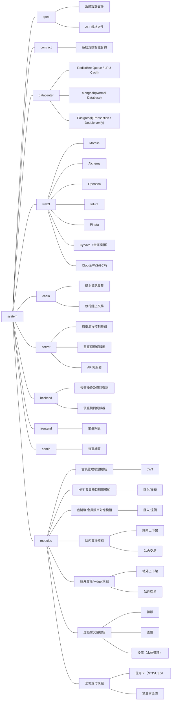

---

tags: Contibit

---

Contibit NFT Market(POC Spec.)
===

---

## 專案核心
- 提供 NFT 項目方 法幣 鑄造按鈕
    - 透過項目方吸引新用戶進入平臺
- 中心化 NFT 交易所
    - 使用中心化交易所無 gas 費用優勢留住使用者
    - 促進低價 NFT 流通
    - 支援除原生幣以外的金流購買
    - 買得到：導入大型平臺已上架物件一鍵代買
    - ~~賣得掉：支援各大型平臺一鍵代上架（未定）~~

---

## 主要功能清單
- 支援繁體中文及英文雙語
- 注冊/登入/登出（手機/email）
- 分級制度（2FA/~~KYC~~）對應每日提領（幣/NFT）限額
- 修改基本資料及密碼/加强認證等級（設定2FA/~~KYC~~）
- 虛擬貨幣 存入及提領
- NFT 存入及提領
- NFT 瀏覽過濾界面（賣場）
    - 購物車
- 我的 NFT 瀏覽過濾界面
    - 上架車
    - 已上架清單
- 賣方固定以原生幣標價，並固定入賬原生幣
- 買方支援非原生幣支付（USDT 換匯/其它原生幣/~~法幣【信用卡】支付~~）
- 查詢自己的 NFT 及 虛擬貨幣交易記錄
- 產生及設定外部交易 widget
    - 項目方鑄造按鈕(法幣【信用卡】支付)
    - ~~NFT 集合/單品 嵌入式賣場(未定)~~
    - ~~產生 NFT（單品/批次）提領（發送、贈送、空投）連結(非必要)~~
- NFT 集合清單 ~~及 市場趨勢、熱度儀表板(非必要)~~
- ~~promo code(推薦連結機制)~~
- ~~withdraw password(第二層 提幣/NFT 密碼)~~

---

## 前臺 UI 頁面清單
一級頁面(可由首頁進入)

- 天
    - Logo
    - 主要頁面選單(瀏覽/我的NFT/已上架清單...)
    - 注冊/登入
    - 
    - 會員ICON（+原生幣金額）
        - 基本資訊【頁面】
        - 錢包【頁面】
        - 交易記錄【頁面】
        - 登出
    - 購物車ICON
    - 上架車ICON
- 地
    - 公司全名/聯絡方式
    - 社群ICONs
    - 各式靜態説明頁
- 首頁（Landing page）
    - 大型輪播形象橫幅
    - 產品介紹（優勢）
    - 成功案例（項目）
    - 團隊介紹
    - 行銷文宣...
<!-- -  -->
- NFT 集合 ~~及 市場趨勢、熱度儀表板 交易榜 富豪榜(非必要)~~
    - 分類、條件過濾
    - 點擊集合至 NFT 瀏覽 頁
    - 
- NFT 瀏覽
    - 各式 想得到 做得了 的過濾方式
    - 過濾模式為單一集合時，加挂顯示集合相關資訊
    - 支援指定使用者過濾模式
    - 加入購物車
        - 接續結賬流程【頁面】
    - NFT 單品資訊彈出視窗
    - 
- 我的 NFT
    - 各式 **有必要** 的過濾方式
    - 標注閉鎖中 NFT
    - NFT 單品資訊彈出視窗
    - 加入上架車
        - 接續上架流程【頁面】
        - 接續提領流程【頁面】
    - 
    - NFT 匯入流程【頁面】
- 我的賣場（已上架 NFT）
    - 顯示目前上架中 NFT 清單
    - 提供 **有必要** 的過濾方式
    - 下架
    - 
- 我的 Widget
    - 目前使用中 Widget 清單 及 狀態
    - 新增 法幣 mint 按鈕
        - 進入新增資料設定流程

---

次級頁面（由流程觸發進入）

- 基本資訊【頁面】
    - 目前會員等級
    - 顯示等級條件和限制
    - 連結 email
    - 設定 2FA
    - 
- 錢包【頁面】
    - 持有幣種清單
    - 顯示閉鎖中金額
    - 顯示匯入錢包地址
    - 提領流程
    -  
- 交易記錄【頁面】
    - 單一綜合表格
    - 簡單過濾機制
    - 非無限查詢期間
    - 
- NFT 購物車結賬流程【頁面】
    - 顯示訂單確認金額
    - [Safe mode](https://gemxyz.notion.site/What-is-Gem-s-Safety-Mode-and-when-should-I-use-it-2e27baa0a0aa48a8834d06e5403e7db0)
    - 選擇付款方式或幣種
    - 支付
    - 
- NFT 上架流程【頁面】
    - 顯示上架清單
    - 設定各平臺各NFT標定金額（頁面可支援快捷模式）
    - 上架
    - 
- NFT 提領流程【頁面】
    - 顯示提領清單
    - 認證匯出地址（使用 冷錢包簽名）
    - 支付提領手續費
    - 匯出
    - 
- NFT 匯入流程【頁面】
    - 選擇公鏈
    - 連接 冷錢包
    - 載入持有 NFT 清單
    - 勾選要匯入的 NFT 加入【匯入車】
    - NFT 白/黑名單檢查
    - 估計 gas 費用
    - 使用冷錢包執行移轉交易（單筆）
    - 或呼叫批次移轉合約（多筆）
    - 

---

## 伺服器功能模組（...）

第一層為專案切分，第二層為專案職責或模組切割
- spec
  - 系統設計文件
  - API 規格文件
- contract
  - 系統支援智能合約
- datacenter
  | 模組 | 内容 | 説明 |
  | --- | --- | --- |
  | Redis | Bee Queue / LRU Cach
  | Mongodb | Normal Database
  | Postgresql | Transaction / Double verify
- web3
  | 模組 | 内容 | 説明 |
  | --- | --- | --- |
  | Moralis | NFT API
  | Alchemy | NFT API
  | Opensea | Market API
  | Infura | Node API
  | Pinata | Storage API
  | Cybavo | 金庫模組
  | Cloud | AWS/GCP
- chain
  - 鏈上資訊收集
  - 執行鏈上交易
- modules
  | 模組 | 内容 | 説明 |
  | --- | --- | --- |
  | 會員管理/認證模組 | JWT
  | NFT 會員賬目對應模組 | 匯入/提領
  | 虛擬幣 會員賬目對應模組 | 匯入/提領
  | 站内賣場模組 | 上下架  交易
  | 站外賣場/widget模組 | 上下架  交易
  | 虛擬幣交易模組 | 扣賬   查價   換匯（水位管理）
  | 法幣支付模組 | 信用卡（NTD/USD）  第三方金流
- server
  - 前臺流程控制模組
  - 前臺網頁伺服器
  - API 伺服器
    - Openapi-Backend
- backend
  - 後臺操作及資料查詢
  - 後臺網頁伺服器
- frontend
  - 前臺網頁
- backend
  - 後臺網頁

### 組織圖展開

---

## 後臺 UI 功能需求（...）

  
清單展開

    
- ~~首頁内容CMS(非必要)~~
- 會員清單
    - 會員詳細資料
    - 停權
- 交易記錄
    - 特定會員
    - 指定區間
- 日期區間統計表
    - 手續費
    - 會員數
    - 上架數
    - 交易數
- 換匯/水位控制臺

---
